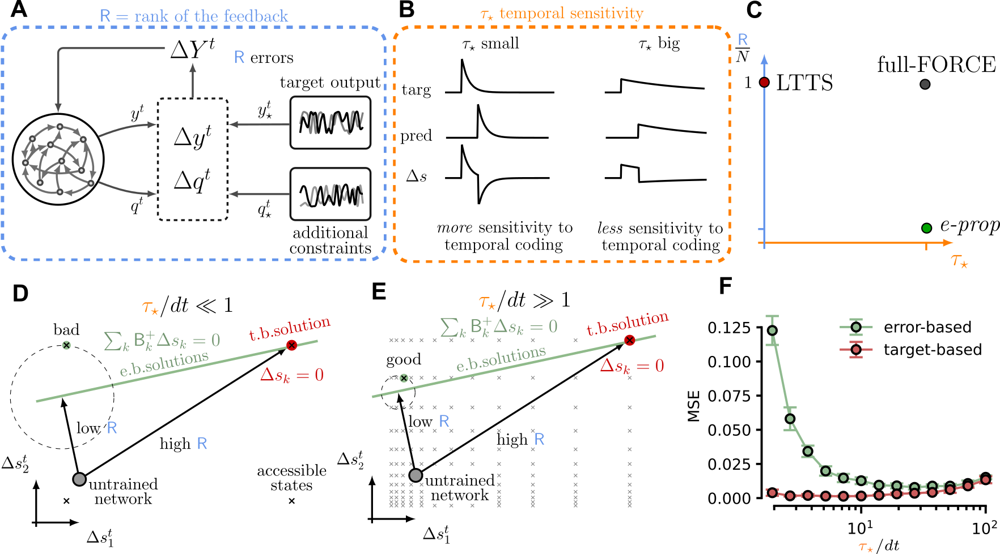
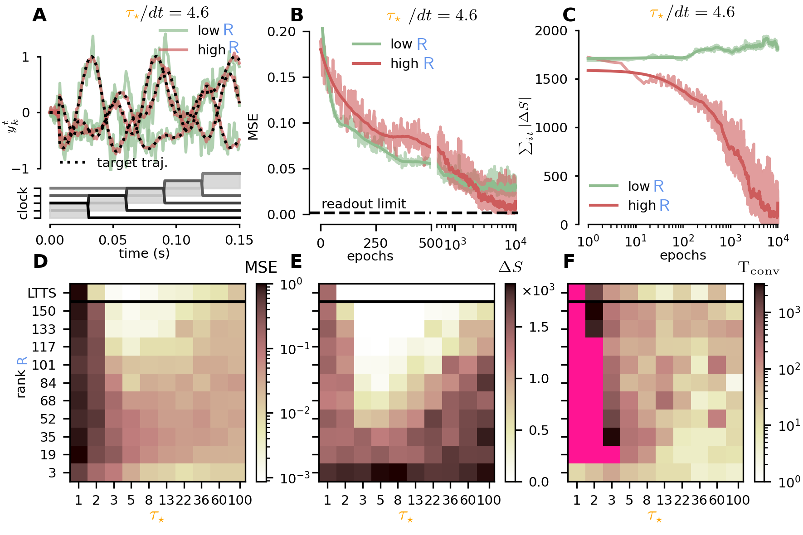

# GOAL: The Code Repository 

This repository hosts the official implementation of `GOAL` as described in the paper: *Error Based or Target Based? A unifying framework for learning in recurrent spiking networks*, Plos Computation Biology (2022).

## Overview

The repository is divided into two folders: a primary one `src/` containing and a secondary `src/numpy`, each one containing the implementation of the same algorithm, the first is built on top of the `PyTorch` library, which enables native GPU support, while the second written in pure `NumPy` (with no GPU support).

# Environments

`GOAL` was tested on Python3 (3.7) and PyTorch (1.6.0). The scripts require the following external libraries to run:

```python
torch
numpy
tqdm
matplotlib # for visualizations
```

All the packages can be installed via the command `pip install <name_of_package>`.

# Usage

## Command Line Interface
We provide a training script `train.py` for the `ND-Trajectory` benchmark. To run it, simply navigate to the appropriate folder where `train.py` is located and launch it via:

```
python test.py -N 150 -T 150 -O 3 -E 5000 1000 -savepath output.pkl --gpu --verbose
```

We report the list of supported arguments.

### **Architecture/Task Parameters**
| Argument | Required | Default | Description |
| :--------: | :--------: | :-----------: | :-----------: |
| `-N`, `-n_rec` | ✔️ | / | Number of recurrent units |
| `-I`, `-n_inp` | ❌ | `5` |Number of input units |
| `-O`, `-n_out` | ❌ | `3` | Number of output units|
| `-T`, `-t_seq` | ❌ | `150` | Lenght of the temporal sequence |

### **Training Parameters**
| Argument | Required | Default | Description |
| :---: | :---: | :---: | :---: |
| `-E`, `-epochs` | ❌ | `(5000, 10000)` | Number of epochs for readout (#1) and recurrent (2) training
| `-R`, `-rank` | ❌ | `None` | Rank of the feedback matrix |
| `-Rlr`, `-rec_lr` | ❌ | `5 / sqrt(N)` | Learning rate of recurrent matrix |
| `-Olr`, `-out_lr` | ❌ | `0.0025` | Learning rate of readout matrix |
| `--gpu` | ❌ | `False` | Flag to signal GPU training
| `--resample` | ❌ | `False` | Flag to trigger resample of feedback matrix at each epoch |

### **Model Parameters** 
| Argument | Required | Default | Description |
| :---: | :---: | :---: | :---: |
| `-Tm`, `-tau_m` | ❌ | `8 (dt)` | Membrane time constant |
| `-Ts`, `-tau_s` | ❌ | `2 (dt)` | Spike time constant |
| `-To`, `-tau_o` | ❌ | `5 (dt)` | Readout time constant |
| `-Si`, `-sigma_inp` | ❌ | `22` | Variance of input matrix |
| `-St`, `-sigma_trg` | ❌ | `8` | Variance of target matrix |
| `-Vo` | ❌ | `-4` | Initial membrane potential |
| `-B`, `-bias` | ❌ | `-4` | Unit bias - External field |
| `-rst`, `-reset` | ❌ | `-20` | Reset current (after spike) |

### **Misc Parameters** 
| Argument | Required | Default | Description |
| :---: | :---: | :---: | :---: |
| `-savepath` | ❌ | `No Saving` | Filepath `.pkl` to store training statistics |
| `-dt` | ❌ | `0.001` | Discrete time interval (in seconds) |
| `--V`, `--verbose` | ❌ | `False` | Verbose flag |


## Launching from a Script

Alternatively one can use directly use a script to train a model. Here we provide a minimal example for training on the `3D-Trajectory` benchmark.

```python
import torch

from utils import build_target, build_clock
from utils import default, train

par = default

# Setting up computing device
device = 'cuda' if torch.cuda.is_available() and par['gpu'] else 'cpu' 
par['device'] = torch.device(device)

# Building input & target trajectory
par['targ'] = build_target(par['n_out'], T = par['t_seq'],     off = 8).to(par['device'])
par['clck'] = build_clock (par['n_inp'], T = par['t_seq'] - 1, off = 0).to(par['device'])

# Here we train the model
stats = train(par)

# Optionally save the statistics to file
```

# Results

Our framework generalized apprentiship learning by introducing two key parameters: the feedback matrix rank 
 
and the internal target timescale  . By doing so one can describe within a single framework previously distinct algorithms for training recurrent spiking networks and introduce new ones. In the figure below one we represent the core ideas from our work and locate in the   plane previously developped algorithms such as: `full-FORCE` (target based), `e-prop` (error-based) and `LTTS` (target based).



We benchmarked our model on the standard `3D Trajectory` task. We studied model training performances (final MSE, final spike-error and convergence speed) for a different values of the two core parameters: the feedback matrix rank   and target timescale  . The results of this exploration highlighted two regions of low-output-error corresponding to the two regimes of target- and error-based, with only target-based methods achieving low spike-errors. Interestingly, we found the `LTTS` algorithm to be quite robust to variation in the   parameter.



For a more in-depth discussion (and applications to closed-loop tasks such as `Bipedal Walker 2D`) refer to [`our pubblication`]().
